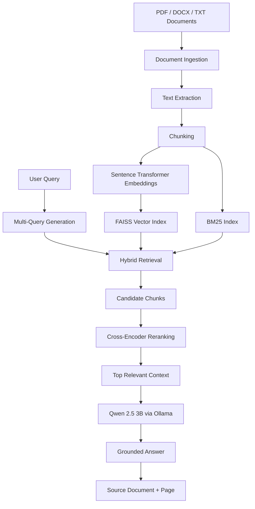

# Enterprise Intelligent Knowledge Retrieval System

> **Enterprise Intelligent Knowledge Retrieval System using Hybrid RAG, Multi-Query Retrieval & Cross-Encoder Reranking**

An end-to-end, **₹0-cost, locally runnable RAG application** for intelligent question answering over enterprise documents. The system combines **BM25 keyword retrieval, semantic vector search, hybrid retrieval, multi-query retrieval, Cross-Encoder reranking, and a local Qwen 2.5 3B LLM running through Ollama**.

---

## 📌 Overview

Traditional keyword search can miss information when the user and document use different wording. A basic semantic search system can also miss exact terms such as policy IDs, names, or codes.

This project combines multiple retrieval strategies to improve the search pipeline:

```text
Documents
   ↓
Text Extraction
   ↓
Chunking
   ↓
Embeddings
   ↓
FAISS + BM25
   ↓
Multi-Query Retrieval
   ↓
Hybrid Retrieval
   ↓
Cross-Encoder Reranking
   ↓
Relevant Context
   ↓
Local Qwen 2.5 3B
   ↓
Grounded Answer + Source
```

The application provides a Streamlit-based interface where users can upload **PDF, DOCX, or TXT** files, build a knowledge base, and ask questions in natural language.

---

## 🎯 Objectives

- Build an enterprise-focused RAG question-answering system.
- Combine **keyword and semantic retrieval** using hybrid search.
- Improve retrieval coverage using **multi-query retrieval**.
- Improve result ordering using **Cross-Encoder reranking**.
- Generate answers using a **local LLM**.
- Keep the complete system free of paid APIs and subscriptions.
- Display source document and page information for traceability.
- Evaluate retrieval quality using a fixed benchmark of 25 test queries.

---

## ✨ Key Features

### 🔍 Hybrid Retrieval
Combines:
- **BM25** for keyword matching
- **FAISS semantic search** for meaning-based retrieval

### 🔄 Multi-Query Retrieval
Generates alternative versions of the user's question so that different document wording can still be discovered.

### 🎯 Cross-Encoder Reranking
Takes retrieved candidates and performs a second-stage relevance ranking.

### 🤖 Local LLM
Uses **Qwen 2.5 3B Instruct** locally through **Ollama**, avoiding paid cloud inference APIs.

### 📄 Multi-Format Document Support
Supports:
- PDF
- DOCX
- TXT

### 📚 Source-Aware Answers
Answers include:
- source document
- page number
- retrieval information

### 🛡️ Grounded Generation
The answer generator is designed to use the supplied retrieved context and avoid unsupported information.

### 📊 Evaluation Dashboard
Provides a dashboard for retrieval metrics and comparison of retrieval approaches.

---

## 🏗️ System Architecture



---

## 🔄 Application Workflow

### 1. Upload Documents
The user uploads PDF, DOCX, or TXT files.

### 2. Document Ingestion
Text is extracted from the uploaded documents.

### 3. Chunking
Large documents are split into smaller text chunks using overlapping windows.

### 4. Embeddings
Each chunk is converted into a vector using:

```text
all-MiniLM-L6-v2
```

### 5. Indexing
Two retrieval indexes are created:

```text
FAISS → semantic similarity
BM25  → keyword relevance
```

### 6. Multi-Query Retrieval
The original question is transformed into multiple alternative search queries.

### 7. Hybrid Retrieval
Keyword and semantic results are combined.

### 8. Reranking
A Cross-Encoder evaluates the retrieved candidates and reorders them by relevance.

### 9. Grounded Generation
The selected context is passed to the local Qwen model.

### 10. Source Display
The final answer is shown with source document and page information.

---

## 🧠 Retrieval Techniques

| Technique | Purpose |
|---|---|
| BM25 | Exact and keyword-oriented retrieval |
| Semantic Search | Meaning-based retrieval using embeddings |
| Hybrid Retrieval | Combines BM25 and semantic retrieval |
| Multi-Query Retrieval | Searches multiple formulations of a question |
| Cross-Encoder Reranking | Performs detailed relevance ranking |

---

## 🛠️ Technology Stack

| Technology | Use |
|---|---|
| Python 3.11 | Core development |
| Streamlit | Web application UI |
| PyMuPDF | PDF text extraction |
| python-docx | DOCX processing |
| Sentence Transformers | Text embeddings |
| all-MiniLM-L6-v2 | Embedding model |
| FAISS | Vector similarity search |
| rank-bm25 | BM25 keyword retrieval |
| Transformers | NLP model support |
| PyTorch | Deep learning backend |
| Cross-Encoder | Reranking |
| Ollama | Local LLM runtime |
| Qwen 2.5 3B Instruct | Local answer generation |
| Plotly | Evaluation charts |

---

## 📂 Project Structure

```text
enterprise-intelligent-knowledge-retrieval/
│
├── app/
│   ├── ingestion.py
│   ├── vector_store.py
│   ├── bm25_retriever.py
│   ├── hybrid_retriever.py
│   ├── multi_query_retriever.py
│   ├── reranker.py
│   ├── hybrid_reranker.py
│   ├── enterprise_retriever.py
│   ├── answer_generator.py
│   ├── rag_pipeline.py
│   │
│   ├── upload_ingestion.py
│   ├── upload_vector_store.py
│   ├── upload_hybrid_retriever.py
│   ├── upload_multi_query_retriever.py
│   ├── upload_enterprise_retriever.py
│   ├── upload_rag_pipeline.py
│   │
│   ├── streamlit_app.py
│   └── pages/
│       └── 2_Evaluation_Dashboard.py
│
├── data/
│   ├── documents/
│   └── chunks.json
│
├── evaluation/
│   ├── evaluate_retrieval.py
│   ├── test_queries.json
│   └── evaluation_results.json
│
├── generate_documents.py
├── create_test_pdf.py
├── dashboard_requirements.txt
├── requirements.txt
├── .gitignore
└── README.md
```

> Generated indexes, uploaded files, local environments, and secrets are intentionally excluded through `.gitignore`.

---

## 📊 Evaluation

The retrieval system was evaluated on **25 predefined benchmark queries**.

| Method | Top-1 / R@1 | R@3 | R@5 | MRR |
|---|---:|---:|---:|---:|
| BM25 | 92% | 96% | 96% | 0.933 |
| Semantic / Vector | 76% | 100% | 100% | 0.873 |
| Hybrid | 88% | 96% | 100% | 0.921 |
| Multi-Query | 92% | 96% | 100% | 0.950 |
| Multi-Query + Reranking | 92% | 96% | 100% | 0.950 |

### Metrics Used

- **Top-1 / Recall@1** — whether the relevant result appears first.
- **Recall@3** — whether a relevant result appears within the top three.
- **Recall@5** — whether a relevant result appears within the top five.
- **MRR (Mean Reciprocal Rank)** — rewards relevant results appearing near the top.

---

## 🧪 External Document Testing

The upload pipeline was tested using an external:

```text
University_Course_Registration_Policy.pdf
```

The system successfully retrieved answers such as:

**Maximum regular-semester registration:** 24 credits

**Regular course registration period:** July 10–25

The system also demonstrated context-aware behavior for questions whose information was not present in the uploaded document by indicating that the requested information was not available in the supplied context.

---

## 💡 Example Question

### User Query

```text
How many work from home days are allowed?
```

### Retrieval

The system identifies the relevant work-from-home policy through its retrieval pipeline.

### Generated Answer

```text
Full-time employees who have completed at least one
year of continuous service can work from home for up
to 8 working days per calendar month.
```

The application also displays the corresponding source document and page.

---

## 🚀 Installation

### 1. Clone the repository

```bash
git clone https://github.com/Akhileshgunadala/enterprise-intelligent-knowledge-retrieval.git
cd enterprise-intelligent-knowledge-retrieval
```

### 2. Create a virtual environment

Windows PowerShell:

```powershell
python -m venv .venv
```

### 3. Activate the environment

```powershell
.\.venv\Scripts\Activate.ps1
```

### 4. Install dependencies

```powershell
pip install -r requirements.txt
```

### 5. Install Ollama

Install Ollama locally and download the Qwen model:

```bash
ollama pull qwen2.5:3b-instruct
```

Make sure Ollama is running before starting the application.

---

## ▶️ Run the Application

From the project root:

```powershell
python -m streamlit run app\streamlit_app.py --server.fileWatcherType none --server.headless true
```

Then open:

```text
http://localhost:8501
```

---

## 🧪 Run Retrieval Evaluation

```powershell
python evaluation\evaluate_retrieval.py
```

The evaluation results are stored in:

```text
evaluation/evaluation_results.json
```

The Streamlit evaluation dashboard can be opened from the application's sidebar/page navigation.

---

## 💰 Cost

This project is designed to run at **₹0 cost** using local/open-source components.

- No paid LLM API required
- No paid vector database required
- No cloud inference required
- Local Qwen model through Ollama
- Local FAISS vector index
- Local BM25 index
- Open-source Python libraries

Hardware performance and response time depend on the local computer.

---

## 🔐 Security and Privacy

The project is designed so that uploaded documents and LLM inference can remain local.

The repository's `.gitignore` excludes:

```text
.env
.venv/
uploads/
user_index/
vectorstore/
__pycache__/
```

Do not commit API keys, passwords, tokens, or private documents to GitHub.

---

## 📈 Future Scope

Possible future improvements include:

- better automatic chunk optimization
- multilingual retrieval
- advanced document parsing
- larger local LLMs where hardware permits
- hybrid reranking strategies
- citation validation
- automated faithfulness evaluation
- user authentication and role-based access
- persistent multi-user knowledge bases
- document versioning

---

## 🎓 Project Highlights

This project demonstrates practical implementation of:

```text
RAG
├── Document Ingestion
├── Text Chunking
├── Embeddings
├── Vector Search
├── BM25
├── Hybrid Retrieval
├── Multi-Query Retrieval
├── Cross-Encoder Reranking
├── Local LLM Inference
├── Grounded Generation
├── Source Attribution
└── Retrieval Evaluation
```

---

## 👤 Author

**Akhilesh Gunadala**

GitHub: [@Akhileshgunadala](https://github.com/Akhileshgunadala)

Project Repository:

https://github.com/Akhileshgunadala/enterprise-intelligent-knowledge-retrieval

---

## 📄 License

This repository can be provided with an appropriate open-source license depending on the intended distribution and academic/project requirements.
